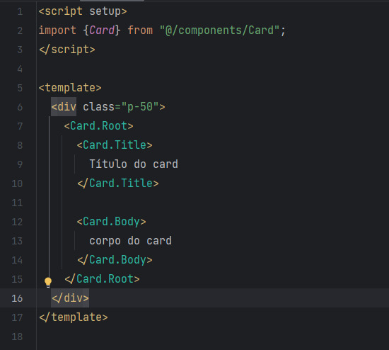

# Apropcalypse

Este projeto é apenas um exemplo de como solucionar 
um problema denominado de apropcalipse.

Apropcalipse foi o termo cunhado por Jenn Creighton na ReactJS 
Girls Conference. Ele representa uma situação em que os componentes 
se afundam em um mar caótico de props, buscando personalizar cada 
detalhe de seu comportamento. Nesse cenário apocalíptico, a 
simplicidade e a clareza dos componentes são comprometidas,
levando a um código confuso e de difícil manutenção.

[Assista Jenn falando sobre apropcalipse](https://www.youtube.com/watch?v=vot0nJJ2Qdo)

Usar excessivamente muitas props em um componente 
pode levar a uma série de problemas que podem dificultar a 
manutenção e o desenvolvimento do código. 
Aqui estão alguns dos principais problemas:

- **Complexidade e Dificuldade de Leitura:** Quanto mais props um componente possui, mais complexo ele se torna. Isso pode dificultar a leitura do código, tornando-o confuso e menos legível. Dificuldades na leitura do código podem levar a erros e a um aumento do tempo necessário para entender como o componente funciona.

- **Acoplamento Excessivo:** Se um componente tem muitas props, ele provavelmente está lidando com muitas responsabilidades diferentes. Isso pode levar a um acoplamento excessivo, onde o componente se torna fortemente dependente de outros componentes e, portanto, mais difícil de reutilizar ou modificar.

- **Risco de Prop Drilling:** Quando um componente precisa repassar várias props para componentes filhos, ocorre o que é chamado de "prop drilling". Isso significa que as props têm que ser passadas através de vários níveis de componentes, mesmo que alguns deles não usem diretamente essas props. Isso pode tornar o código mais confuso e dificultar a identificação da origem e do destino das props.

- **Maior Chance de Erros:** Quanto mais props um componente recebe, maior a chance de cometer erros ao passá-las ou usá-las corretamente. Erros de digitação ou propriedades ausentes podem ocorrer mais frequentemente, especialmente em componentes grandes.

- **Dificuldade na Manutenção:** Componentes com muitas props tendem a ser mais difíceis de manter e atualizar. Qualquer alteração nas props pode afetar várias partes do código, o que torna o rastreamento de mudanças mais complicado.

- **Performance:** Embora o impacto no desempenho geralmente seja pequeno, muitas props podem levar a um consumo ligeiramente maior de memória e tempo de renderização, uma vez que mais dados precisam ser gerenciados e propagados.

- **Evolução do Código:** À medida que o código evolui, pode haver casos em que algumas props não são mais necessárias ou novas props precisam ser adicionadas. Com muitas props existentes, a adição ou remoção de props pode se tornar uma tarefa delicada e propensa a erros.

## Solução

O conceito é dividir a responsabilidade de um componente em especializações menores. Por exemplo, um componente chamado "Card" é desmembrado em componentes "Root", "Body" e "Title", usando um arquivo "index.js" para exportá-los, facilitando sua utilização e melhorando a organização, reutilização e escalabilidade do código.

#### Beleza, e agora como utilizo o compoenten Card?

É simples, seja o exemplo abaixo:

Show!

Neste exemplo específico, não foram utilizadas props, pois o objetivo era demonstrar a solução para um problema específico. A explicação detalhada sobre o problema e a solução podem ser encontradas no arquivo, juntamente com o link para a conferência onde tudo é explicado com mais detalhes. A conferência é uma ótima fonte para entender melhor o contexto e a abordagem adotada.